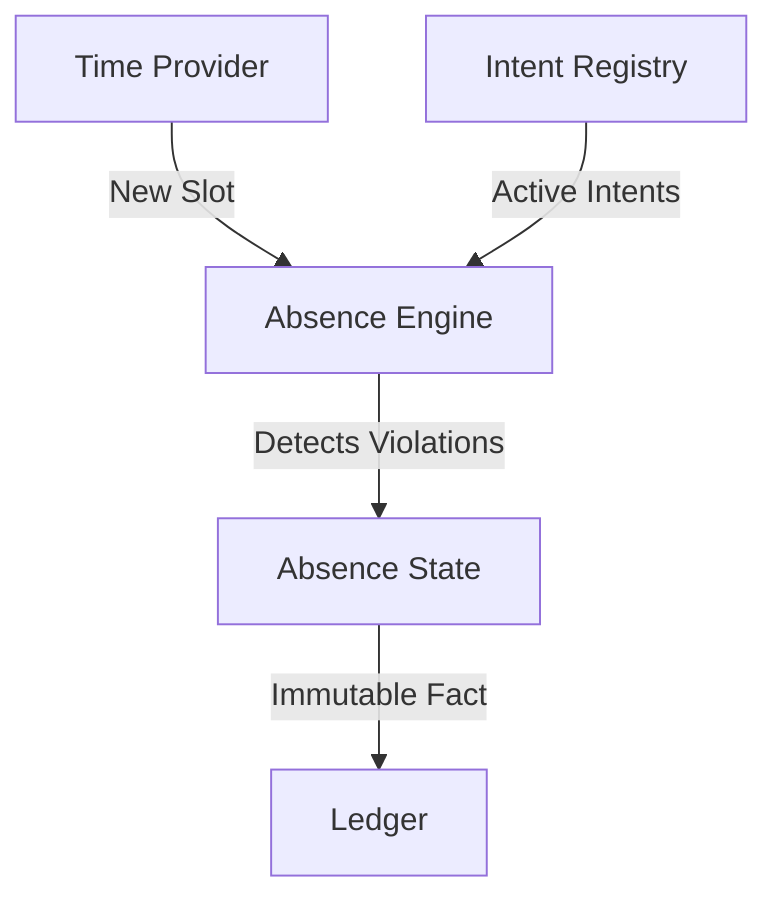

# TASM Kernel Architecture Design (v1.0)

**Status**: Draft Specification
**Target**: Phase 0 (Phoenix) - Isolated Kernel
**Language**: Rust

## 1. Architectural Overview

The TASM Kernel is a **passive state machine**. It does not execute transactions in the traditional sense. Instead, it advances time and crystallizes "Absences" (impossibilities) based on strict deadlines.

### Component Logic


## 2. Core Data Structures (Rust)

### 2.1 Time
Time is discrete and monotonic.

```rust
pub type Slot = u64;

pub trait TimeProvider {
    fn current_slot(&self) -> Slot;
}
```

### 2.2 Intent (The Fundamental Atom)
An `Intent` differs from a Transaction. It is a commitment that *can* fail.

```rust
#[derive(Debug, Clone, PartialEq, Eq, Hash)]
pub struct IntentId(pub [u8; 32]);

#[derive(Debug, Clone)]
pub struct Intent {
    pub id: IntentId,
    pub creator: [u8; 32],
    pub description: Vec<u8>, // Hash of the actual commitment details
    pub deadline: Slot,
    pub collateral_amount: u64,
}
```

### 2.3 Absence (The Result)
An `Absence` is the irrefutable fact that an Intent was not fulfilled by its deadline.

```rust
#[derive(Debug, Clone)]
pub struct Absence {
    pub intent_id: IntentId,
    pub declared_at: Slot, // The slot when the absence became true
    pub violation_proof: Vec<u8>, // Cryptographic proof of non-inclusion (optional for now)
}
```

## 3. The Kernel Traits

### 3.1 Intent Registry
Manages the set of active promises.

```rust
pub trait IntentRegistry {
    /// Register a new intent.
    fn register(&mut self, intent: Intent) -> Result<(), Error>;

    /// Mark an intent as fulfilled (action observed).
    fn fulfill(&mut self, intent_id: IntentId, proof: Evidence) -> Result<(), Error>;

    /// Get all intents that satisfy a predicate (e.g., deadline < current_slot).
    fn pending_expired(&self, current_slot: Slot) -> Vec<Intent>;
}
```

### 3.2 The Absence Engine (Core Logic)
The heart of the system. It takes time and produces absences.

```rust
pub struct AbsenceEngine<R: IntentRegistry> {
    registry: R,
    current_slot: Slot,
}

impl<R: IntentRegistry> AbsenceEngine<R> {
    pub fn new(registry: R, start_slot: Slot) -> Self {
        Self { registry, current_slot: start_slot }
    }

    /// The "heartbeat" of the chain.
    /// Returns a list of new Absences generated by this tick.
    pub fn advance_time(&mut self, new_slot: Slot) -> Vec<Absence> {
        if new_slot <= self.current_slot {
            return vec![]; // Time cannot go backwards or stay still
        }

        self.current_slot = new_slot;
        
        // 1. Identify all intents that just expired
        let expired = self.registry.pending_expired(self.current_slot);
        
        // 2. Convert them to Absences
        let mut new_absences = Vec::new();
        for intent in expired {
            let absence = Absence {
                intent_id: intent.id,
                declared_at: self.current_slot,
                violation_proof: vec![], // In naive kernel, logic implies proof
            };
            new_absences.push(absence);
            
            // 3. (Implicit) Intent is removed from "active" and moved to "failed"
            // In a real system, this triggers the collateral slash.
        }

        new_absences
    }
}
```

## 4. State Transition Function (STF)

The State of a TASM-chain is defined not by account balances, but by the accumulation of Absences.

$$ S_{t+1} = S_t \cup \{ Abs(i) \mid \text{deadline}(i) < t+1 \land i \notin \text{Fulfilled} \} $$

In Rust code:

```rust
pub fn state_transition(
    current_state: &mut GlobalState,
    time_update: Slot
) {
    let new_absences = current_state.engine.advance_time(time_update);
    current_state.ledger.append(new_absences);
}
```

## 5. Implementation Strategy (Phoenix)

For the "Phoenix" MVP, we will implement this in pure Rust without networking.

1.  **Crate**: `tasm_core`
2.  **Modules**:
    *   `model.rs`: Data structures
    *   `engine.rs`: The `advance_time` logic
    *   `memory.rs`: In-memory implementation of `IntentRegistry` for testing
3.  **Simulation**:
    *   A simple `main.rs` that simulates a loop of:
        *   User creates intent
        *   Time passes
        *   User fails to act
        *   **Verify**: Absence is generated automatically

## 6. Next Steps
Move to **Step 4: Working Prototype (POC)** by implementing this specification in a new `Abstract36/tasm-kernel` directory.
